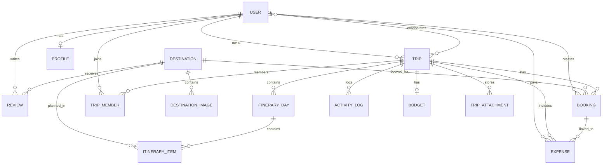

# ERD

## Auth flow

1. User submits registration data to `/api/auth/register/`.
2. The API validates and creates the `User` and default `Profile`.
3. User requests `/api/auth/login/` and receives a JWT access and refresh token.
4. The client sends the access token as `Authorization: Bearer <token>`.
5. Protected endpoints validate the token and enforce role-based permissions.

## Permission matrix

| Resource | Owner | Collaborator | Viewer | Authenticated | Anonymous |
| --- | --- | --- | --- | --- | --- |
| Trip | Full CRUD | Read + update shared trip data | Read only | Yes | No |
| Booking | Full CRUD | Read + update shared bookings | Read only | Yes | No |
| Expense | Full CRUD | Read + create update own entries | Read only | Yes | No |
| Review | Own review only | Own review only | No | Read only | Read only |
| Destination | N/A | N/A | N/A | Read only | Read only |

## API endpoints

- GET/POST `/api/auth/register/`, `/api/auth/login/`, `/api/auth/me/`, `/api/auth/profile/`
- GET `/api/destinations/`, `/api/destinations/trending/`
- GET/POST `/api/trips/`, `/api/trips/summary/`
- GET/POST/DELETE `/api/trips/<id>/members/`
- GET/POST `/api/trips/<id>/days/`
- GET/POST `/api/bookings/`
- GET/POST `/api/budgets/budgets/`, `/api/budgets/expenses/`
- GET/POST `/api/reviews/`, `/api/reviews/destinations/<id>/summary/`
- Documentation: `/api/schema/`, `/api/docs/`, `/api/redoc/`
